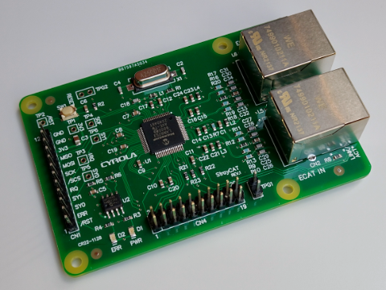

# StrayCAT
EtherCAT slave board using LAN9252

The design CAD is CircuitStudio. Board dimensions and hole locations are Raspberry Pi compliant, but other component placement is original and not mechanically compatible with any product. The SPI communication port conforms to the EasyCAT PRO pinout.

This stray board has not been tested by EtherCAT conformance testing and does not have the EtherCAT logo printed on it.
