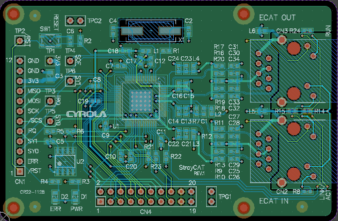

# StrayCAT
 EtherCAT Slave board using LAN9252

The design CAD is CircuitStudio. The pattern width of the differential lines is 6.929 mils and the spacing is 5.41 mils, designed to have an impedance of 100-Ohm when the board is manufactured to standard PCBGOGO specifications.